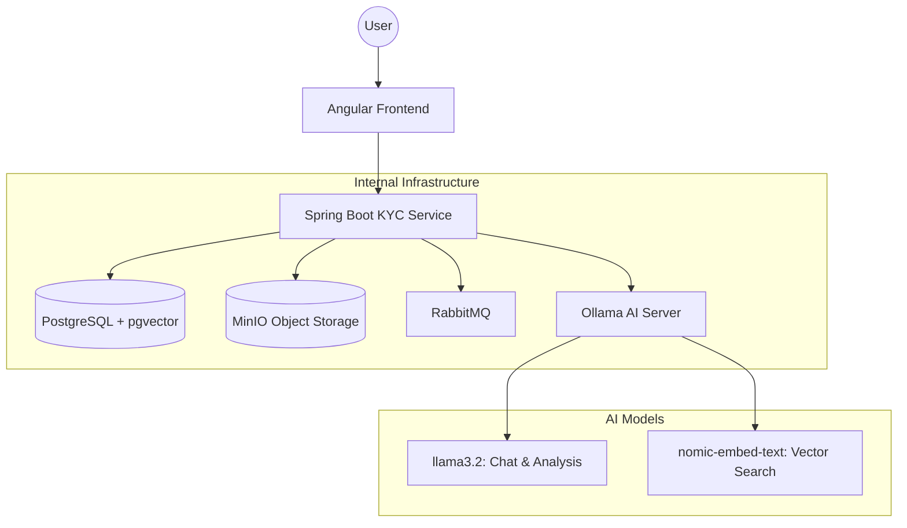

# KYC AI Application: Beginner's Blueprint & Guide

This document provides a high-level overview of the **KYC AI Application**, explaining its architecture, workflows, and technical environment for anyone new to the project.

---

## 1. Project Overview & Aim
**KYC (Know Your Customer)** is a critical security process used by financial and legal institutions to verify the identity of their clients. 

**The Aim of this Project**:
- **Automate Identity Verification**: Use Artificial Intelligence (AI) to read and validate documents like passports and ID cards instantly.
- **GDPR by Design**: Ensure that all personal data is handled according to European privacy laws (encryption, anonymization, and right-to-erasure).
- **Localized Privacy**: Use *Local LLMs* (Large Language Models) so that sensitive data never leaves your server (no external cloud APIs like OpenAI are used for processing).

---

## 2. The Blueprint (Architecture)

The application follows a modern **microservices-inspired architecture** orchestrated by Docker.

### Core Components:
1.  **Angular Frontend**: A standalone web app where users upload documents and chat with support.
2.  **Spring Boot Backend**: The "brain" that coordinates between the database, storage, and AI.
3.  **PostgreSQL (with pgvector)**: Stores user data and *mathematical representations* (vectors) of documents for the AI to search through.
4.  **Ollama**: Runs the AI models locally on your machine.
5.  **MinIO**: Securely stores the actual document images (like your passport JPG).

---

## 3. Workflows (How it works)

### Workflow A: Document Submission & Analysis
1.  **Upload**: User uploads a passport image.
2.  **Storage**: The image is saved in **MinIO**.
3.  **OCR**: The system uses **Tesseract** to "read" the text from the image.
4.  **AI Verification**: The **DocumentAgent** analyzes the text:
    - *"Is this a real passport?"*
    - *"Is it expired?"*
    - *"Does the name match the user's profile?"*
5.  **Result**: The status is updated in the dashboard (Verified / Rejected / Needs Review).

### Workflow B: The AI Chatbot (RAG)
1.  **Question**: User asks, *"How long does verification take?"*
2.  **Search**: The system searches the **Knowledge Base** (PDFs of company policies) for the answer.
3.  **Prompt**: The AI combines the user's question with the relevant policy text.
4.  **Response**: The AI generates a human-like answer based *only* on the provided policies.

---

## 4. Technical Environment

| Technology | Role | Why we use it? |
| :--- | :--- | :--- |
| **Java 21 / Spring Boot** | Backend Framework | Robust, secure, and industry-standard for enterprise apps. |
| **Angular 18** | Frontend Framework | Fast, scalable, and uses modern "Signals" for smooth UI updates. |
| **Docker** | Containerization | Ensures the app runs exactly the same on every computer. |
| **LangChain4j** | AI Integration | The library that bridges Java code with AI models. |
| **Ollama** | Local LLM Runtime | Runs professional-grade AI without needing an internet connection. |
| **Flyway** | DB Migrations | Keeps the database structure in sync across all team members. |

---

## 5. Summary for Beginners
If you are just starting, remember these three key concepts:
- **Standalone**: Every part of the app is self-contained.
- **Privacy First**: We encrypt data first and ask questions later.
- **Local AI**: We don't send data to the cloud; your computer handles the "thinking".
